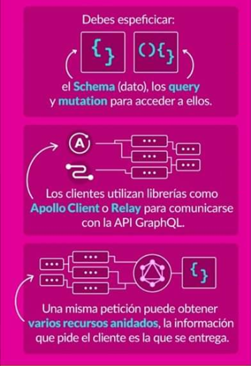
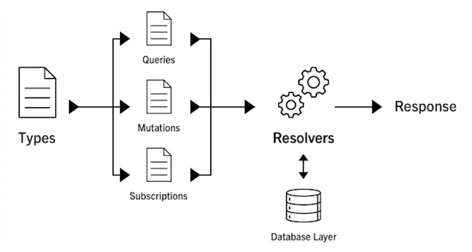

# GraphQL

Es un lenguaje creado por Facebook en 2012 para **manipular y realizar consultas de datos**.

Describe las **las capacidades y los requsitos** de los modelos de datos para aplicaciones cliente-servidor.



## Diccionario de datos


1. **Type defs** Definición de tu arquitectura de datos de tu api

2. **Query**: Definición de una consulta

3. **Mutation**: Querys encargadas de modificar y actualizar datos.

4. **Subscriptions**: Forma en que GraphQL maneja los eventos que emite un servidor el cual diferentes clientes puden subscribirse.

5. **Resolvers**: Encargados de darle la lógica a las querys de tu API.

6. **Apollo Server**: Define tu servidor con graphql y la comunicación de tu API.


## Creación carpeta proyecto

```
mkdir live-graphql
cd live-graphql
```

## Desarrollo de dependencias

```
npm init -y
npm i nodemon@2.0.2 -D
npm i apollo-server@2.11.0
npm i dotenv@8.2.0
npm i apollo-server-express@2.11.0
npm i express@4.17.1
npm i gaphql@15.0.0
npm i gaphql-tools@7.0.2
npm i mongoose@5.9.7
```

## Ejecución Proyecto

```
$ npm start 
```

## Diagrama de GraphQL




